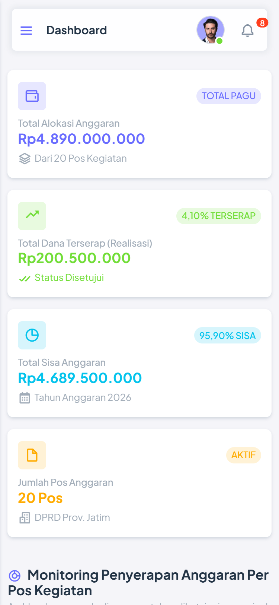
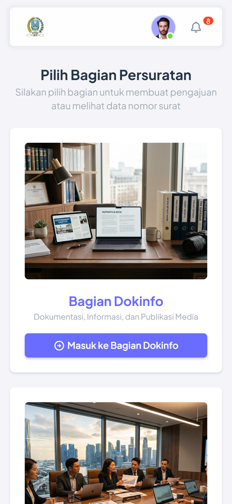
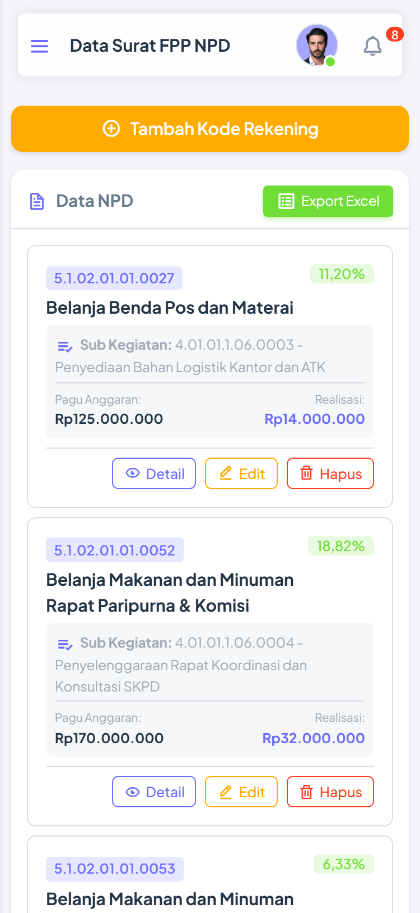
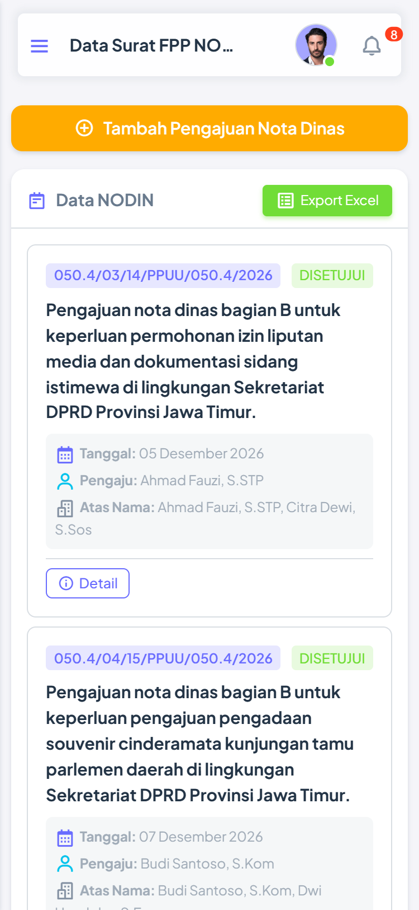
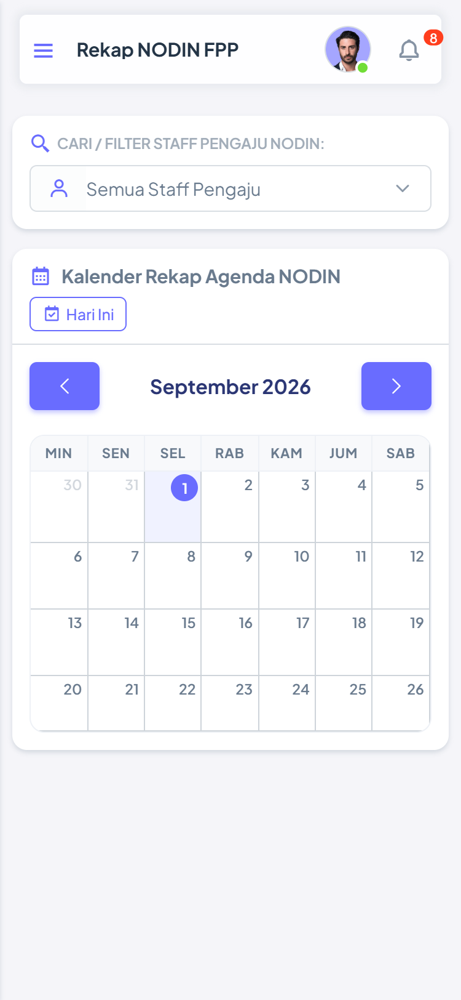
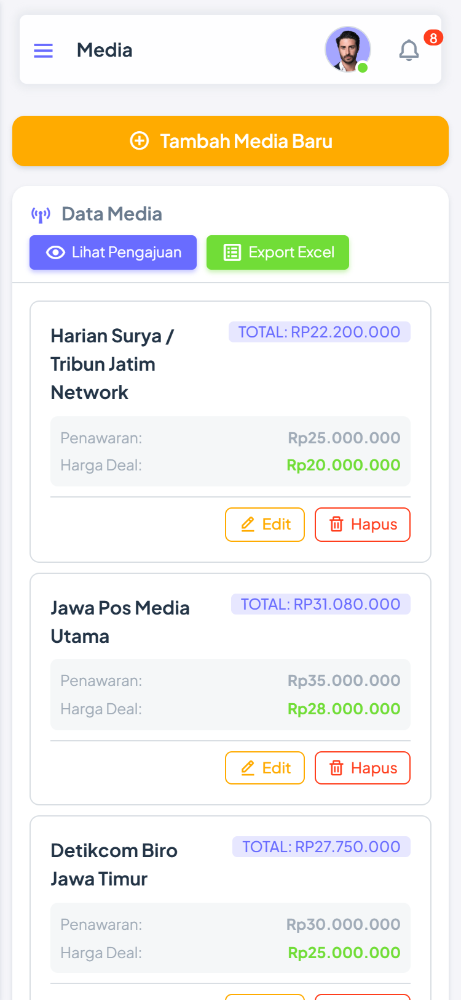

# 🏛️ Website Persuratan Instansi & Pengelolaan Anggaran
### Sekretariat Dewan Perwakilan Rakyat Daerah (DPRD) Provinsi Jawa Timur

[](https://laravel.com)
[](https://php.net)
[](https://getbootstrap.com)
[](#-desain-responsif--mobile-first-experience)
[-brightgreen?style=for-the-badge)](docs/DOKUMEN_UAT_SISTEM_PERSURATAN_DPRD_JATIM.docx)
[](LICENSE)

---

## 📌 Tentang Aplikasi

**Sistem Informasi Manajemen Persuratan & Pengelolaan Anggaran (SIM-Persuratan)** adalah platform digital berbasis web terintegrasi dan responsif yang dirancang khusus untuk memodernisasi tata kelola administrasi persuratan, pengajuan nota pencairan dana, nota dinas, serta manajemen publikasi media di lingkungan **Sekretariat DPRD Provinsi Jawa Timur**.

Sistem ini memfasilitasi alur kerja birokrasi yang transparan, akuntabel, dan *paperless*, mulai dari pengusulan draf surat oleh Staf, verifikasi serta validasi oleh Admin Bagian (*Bagian Dokumentasi & Informasi / Dokinfo* dan *Bagian Fasilitasi Penganggaran & Pengawasan / FPP*), hingga monitoring serapan anggaran eksekutif oleh Super Admin secara *real-time*.

---

## 📱 Desain Responsif & Mobile-First Experience

Aplikasi ini telah dioptimalkan secara menyeluruh untuk memberikan kenyamanan penggunaan terbaik di berbagai resolusi layar:
* **💻 Desktop & Laptop View ($1920\text{px} - 1366\text{px}$)**: Tampilan tabel data interaktif dengan kolom komprehensif, grafik donat statistik serapan anggaran, dan visualisasi kalender agenda.
* **📱 Mobile Smartphone View ($390\text{px} - 768\text{px}$)**: Tabel otomatis beralih menjadi format **Kartu Data Mobile (*Card List View*)** yang rapi, padat, dan bebas dari masalah tabel meluap (*no horizontal scroll overflow*).
* **🍔 Mobile Drawer Sidebar**: Navigasi menu samping *offcanvas* yang mulus dengan tombol hamburger yang mudah diakses dengan ibu jari.
* **⚡ Touch-Friendly Action Buttons**: Tombol aksi persetujuan, penolakan, edit, dan unduh dokumen disesuaikan untuk layar sentuh ponsel.

---

## 🌟 Fitur Utama Sistem

### 1. 📊 Dashboard Eksekutif & Realisasi Anggaran Real-time
* Monitoring total pagu anggaran tahunan APBD, akumulasi dana terserap (*realisasi* dari pengajuan yang disetujui), dan sisa pagu aktif.
* Visualisasi diagram donat interaktif (*ApexCharts*) per agenda kegiatan dan sub kegiatan.
* Rekapitulasi serapan anggaran per bagian kedinasan (*Bagian Dokinfo & Bagian FPP*).

### 2. 📑 Pengelolaan Nota Pencairan Dana (NPD)
* Penomoran surat otomatis berstandar kedinasan (`[Kode]/KPA/PPU.03/[Bulan]/[Tahun]`).
* Validasi sisa pagu rekening belanja saat pengajuan dibuat untuk mencegah *over-budget*.
* Alur status persuratan: **Diajukan**, **Disetujui**, atau **Ditolak** (disertai catatan alasan penolakan dari admin).
* Fitur **Perbaiki & Ajukan Ulang (*Resubmit*)** eksklusif bagi staf pengaju surat.

### 3. ✉️ Pengelolaan Nota Dinas (NODIN) & Rekap Kalender
* Integrasi klasifikasi naskah dinas dengan **Master Index Kegiatan APBD**.
* Manajemen penugasan multi-staf kedinasan (*Atas Nama*).
* **📅 Rekap Kalender Agenda NODIN Interaktif**:
  * Tampilan kalender bulanan terstruktur berbasis FullCalendar.
  * Navigasi cepat antar bulan (*Previous & Next*) dengan judul bulan di posisi tengah.
  * **Filter Pencarian Staf**: Memfilter agenda kegiatan berdasarkan staf penginput secara *real-time*.
  * Modal pop-up informasi lengkap saat agenda kegiatan diklik.

### 4. 📰 Manajemen Rekanan Media Publikasi & Advertorial
* Pencatatan master data rekanan media massa (Cetak, Online, Televisi, dan Radio).
* **Kalkulasi Kontrak Otomatis**: Harga Penawaran, Harga Kesepakatan (*Deal*), dan perhitungan Pajak Pertambahan Nilai (PPN 11%).
* Pengajuan tayang berita liputan dewan dan verifikasi tayang publikasi.

### 5. 🏛️ Format Hasil Cetak & Ekspor Dokumen Resmi (Microsoft Excel)
Seluruh modul ekspor data (**NPD, NODIN, dan Media**) menghasilkan dokumen berstandar kedinasan resmi:
* **Kop Surat Kedinasan**: Pemerintah Provinsi Jawa Timur & Sekretariat DPRD Jawa Timur.
* **Logo Resmi Instansi**: Tersemat rapi di sudut kiri atas kop surat.
* **Garis Ganda Pemisah (*Double Border*)**: Pembatas resmi antara kop surat dan badan tabel.
* **Metadata Cetak**: Keterangan Bagian/Unit Kerja, Tanggal & Waktu Cetak (WIB), Nama & Email Pencetak, serta Total Data.
* **Header Berwarna**: Latar belakang **Deep Corporate Navy Blue** (`#1E3A8A`) dengan teks putih tebal.
* **Zebra Striping & Format Rupiah**: Pemformatan mata uang resmi (`Rp #,##0`) dan baris selang-seling abu-abu muda (`#F8FAFC`).
* **Baris Total & Blok Tanda Tangan (*Sign-off*)**: Rumus akumulasi otomatis `=SUM(...)` dan kolom tanda tangan pejabat pengesah beserta NIP.

### 6. 🔐 Keamanan Kata Sandi & Manajemen Pengguna
* **Ikon Mata (*Show/Hide Password*)**: Fitur *toggle* pada form tambah dan edit admin/staf untuk melihat kata sandi saat mengetik tanpa risiko salah input.
* **Proteksi Enkripsi Password**: Pembaruan password aman tanpa risiko *double hashing*.
* **Pop-up Konfirmasi SweetAlert2**: Dialog konfirmasi simpan/hapus muncul di lapisan terdepan (`z-index: 20000`) di atas modal bootstrap.

### 7. 👥 Multi-Role & Hak Akses Berjenjang (RBAC)
* **Super Admin**: Akses penuh seluruh modul, manajemen pengguna (*Admin & Staf*), master data APBD, dan laporan keuangan eksekutif.
* **Admin Bagian Dokinfo (Admin A)**: Akses penuh modul persuratan Dokinfo (NPD, NODIN, Media), verifikasi pengajuan, kalender rekap, dan ekspor data.
* **Admin Bagian FPP (Admin B)**: Akses penuh modul persuratan FPP (NPD, NODIN), verifikasi pengajuan, kalender rekap, dan ekspor data.
* **Staff**: Mendarat di **Menu Layanan Surat (`/menu`)**, input pengajuan baru, perbaikan dokumen ditolak (*resubmit*), dan pelacakan status.

---

## 🖼️ Tampilan Antarmuka Utama

### 1. Dashboard Eksekutif & Visualisasi Anggaran
Menampilkan ringkasan metrik statistik persuratan, serapan anggaran, dan diagram penyerapan per agenda kegiatan.


---

### 2. Portal Pemilihan Layanan Bagian Kedinasan
Navigasi visual modern untuk mengakses operasional **Bagian Dokinfo** dan **Bagian FPP**.


---

### 3. Alokasi Pagu & Rekening NPD
Pengelolaan alokasi belanja anggaran agenda kegiatan, monitoring realisasi, dan sisa dana per sub kegiatan.


---

### 4. Detail Tracking & Persetujuan Surat NPD
Tabel tracking riwayat pengajuan surat, badge status, catatan penolakan, serta tombol aksi perbaikan & persetujuan.


---

### 5. Rekapitulasi Kalender Agenda Nota Dinas (NODIN)
Kalender interaktif penataan jadwal agenda kegiatan naskah dinas dengan filter pencarian nama staf.


---

### 6. Manajemen Rekanan Media Publikasi
Pencatatan daftar media mitra, penawaran harga, nilai deal, dan kalkulasi PPN 11% otomatis.


---

## 📱 Galeri Tampilan Responsif Mobile Smartphone (Mobile View)

Sistem telah dioptimalkan secara responsif (*Mobile-First*) sehingga pada layar smartphone ($390\text{px}$), tabel data otomatis beralih menjadi format kartu (*Card List View*) yang rapi, padat, dan nyaman dioperasikan dengan sentuhan jari:

| Dashboard & Statistik Mobile | Menu Layanan Staf Mobile | Daftar Kartu NPD Mobile |
| :---: | :---: | :---: |
|  |  |  |

| Daftar Kartu NODIN Mobile | Kalender Agenda Mobile | Tracking Media Mobile |
| :---: | :---: | :---: |
|  |  |  |

---

> 📖 **Ingin melihat dokumentasi seluruh tampilan halaman lainnya?**  
> 👉 **[Buka Galeri Screenshot Lengkap Desktop & Mobile (docs/SCREENSHOTS.md)](docs/SCREENSHOTS.md)**

## 🛠️ Teknologi & Dependensi Sistem

- **Backend Framework**: [Laravel 11.x](https://laravel.com/) (PHP 8.2+)
- **Database**: MySQL / MariaDB (InnoDB Engine)
- **Frontend Framework & Styling**: Bootstrap 5.3, Custom Responsive CSS
- **Iconography**: Boxicons Font & Icons
- **Charting Engine**: [ApexCharts.js](https://apexcharts.com/)
- **Calendar Engine**: [FullCalendar 6.x](https://fullcalendar.io/)
- **Interactive Modals & Alerts**: [SweetAlert2](https://sweetalert2.github.io/)
- **Spreadsheet & Excel Generator**: [PhpSpreadsheet](https://phpspreadsheet.readthedocs.io/) & [Laravel Excel 3.1](https://laravel-excel.com/)
- **Word Document Generator**: [docx](https://docx.js.org/)

---

## 🚀 Panduan Instalasi & Menjalankan Lokal

### 1. Prasyarat Sistem
Pastikan perangkat Anda telah terpasang:
- PHP >= 8.2 dengan ekstensi `pdo_mysql`, `mbstring`, `openssl`, `gd`, `zip`, `fileinfo`
- [Composer](https://getcomposer.org/)
- [Node.js & NPM](https://nodejs.org/)
- MySQL / MariaDB Server (misal: via XAMPP / Laragon)

---

### 2. Kloning Repositori
```bash
git clone https://github.com/nurauliakarisma/Website_Persuratan-Instansi.git
cd Website_Persuratan-Instansi
```

---

### 3. Instalasi Dependensi PHP & JavaScript
```bash
# Instal dependensi PHP
composer install

# Instal dependensi JavaScript
npm install
```

---

### 4. Konfigurasi Environment (`.env`)
Salin berkas `.env.example` menjadi `.env`:
```bash
cp .env.example .env
```

Sesuaikan konfigurasi database pada berkas `.env`:
```env
DB_CONNECTION=mysql
DB_HOST=127.0.0.1
DB_PORT=3306
DB_DATABASE=db_persuratan
DB_USERNAME=root
DB_PASSWORD=
```

---

### 5. Generate Application Key & Link Storage
```bash
php artisan key:generate
php artisan storage:link
```

---

### 6. Migrasi Database & Seeding Data Awal
Jalankan migrasi tabel dan pengisian master data APBD serta akun bawaan:
```bash
php artisan migrate --seed
```

---

### 7. Jalankan Server Aplikasi
```bash
php artisan serve
```
Akses aplikasi melalui browser pada alamat: **`http://127.0.0.1:8000`**

---

## 🔑 Akun Pengguna Bawaan (Default Credentials)

| Peran / Role | Email Login | Kata Sandi | Deskripsi Hak Akses |
| :--- | :--- | :--- | :--- |
| **Super Admin** | `superadmin@gmail.com` | `password123` | Akses penuh seluruh modul, master data, dan manajemen user |
| **Admin Dokinfo** | `admina@gmail.com` | `password123` | Administrator Bagian Dokumentasi & Informasi |
| **Admin FPP** | `adminb@gmail.com` | `password123` | Administrator Bagian Fasilitasi Penganggaran & Pengawasan |
| **Staff Persuratan** | `staff@gmail.com` | `password123` | Akun Staf Pengaju (Qc Aulia Karisma, S.STP) |

---

## 📂 Struktur Direktori Proyek

```plaintext
Website_Persuratan-Instansi/
├── app/
│   ├── Exports/            # Generator ekspor Excel resmi berkop (NPD, NODIN, Media)
│   ├── Http/Controllers/  # Controller logika bisnis persuratan & keuangan
│   ├── Http/Middleware/   # Middleware pembatasan hak akses role (RoleMiddleware)
│   └── Models/             # Model database Eloquent ORM
├── config/                 # Berkas konfigurasi sistem Laravel
├── database/
│   ├── migrations/         # Skrip skema database
│   └── seeders/            # Seeder data pengguna & master APBD
├── docs/
│   ├── DOKUMEN_UAT_SISTEM_PERSURATAN_DPRD_JATIM.docx # Dokumen Word UAT resmi
│   ├── SCREENSHOTS.md      # Galeri screenshot antarmuka
│   └── screenshots/        # Berkas gambar tangkapan layar antarmuka
├── public/                 # Aset statis publik (CSS, JS, Logo, Images)
├── resources/
│   └── views/              # Template Blade UI (Admin Layouts & View Components)
├── routes/
│   └── web.php             # Definisi rute URL dan proteksi middleware
└── README.md               # Dokumentasi utama proyek
```

---

## 📄 Hak Cipta & Ketentuan Penggunaan (License)

**Hak Cipta &copy; 2026 Nur Aulia Karisma Dewi. Seluruh Hak Dilindungi Undang-Undang.**  
*(Copyright &copy; 2026 Nur Aulia Karisma Dewi. All rights reserved.)*

Kode sumber, arsitektur basis data, modul Nota Pencairan Dana (NPD), Nota Dinas (NODIN), Manajemen Media Publikasi, serta materi penyerta pada sistem ini merupakan hak milik eksklusif dari **Nur Aulia Karisma Dewi**.

Dilarang keras menyalin, menggandakan, mendistribusikan, memodifikasi, mempublikasikan ulang, atau mengklaim kepemilikan atas proyek ini maupun bagian mana pun darinya tanpa izin tertulis resmi dari pemilik hak cipta. Rincian lengkap dapat dibaca pada berkas [LICENSE](LICENSE).
