# 📸 Galeri Tangkapan Layar & Dokumentasi Fitur Lengkap

Dokumentasi visual komprehensif dari seluruh antarmuka dan modul fitur **Sistem Informasi Manajemen Persuratan & Pengelolaan Anggaran (SIM-Persuratan DPRD Provinsi Jawa Timur)**.

---

## 📑 Daftar Isi Visual
1. [🔐 Autentikasi & Keamanan](#1--autentikasi--keamanan)
2. [📊 Dashboard Eksekutif & Analisis Keuangan](#2--dashboard-eksekutif--analisis-keuangan)
3. [🏛️ Portal Pemilihan Bagian](#3--portal-pemilihan-bagian)
4. [📑 Pengelolaan Nota Pencairan Dana (NPD)](#4--pengelolaan-nota-pencairan-dana-npd)
5. [✉️ Pengelolaan Nota Dinas (NODIN)](#5--pengelolaan-nota-dinas-nodin)
6. [📰 Manajemen Media & Publikasi Pemberitaan](#6--manajemen-media--publikasi-pemberitaan)
7. [⚙️ Master Data & Konfigurasi Sistem](#7--master-data--konfigurasi-sistem)
8. [👥 Manajemen Pengguna & Hak Akses](#8--manajemen-pengguna--hak-akses)
9. [🔔 Notifikasi & Konfirmasi Interaktif](#9--notifikasi--konfirmasi-interaktif)

---

## 1. 🔐 Autentikasi & Keamanan

### Halaman Login
Halaman autentikasi aman bagi seluruh pengguna (Super Admin, Admin Bagian Dokinfo, Admin Bagian FPP, dan Staf). Dilengkapi validasi form interaktif dan pengalihan dinamis berbasis peran (*role-based redirection*).

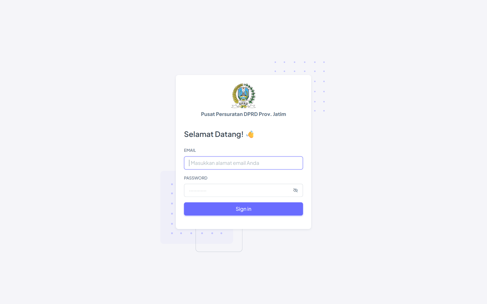

---

## 2. 📊 Dashboard Eksekutif & Analisis Keuangan

### Beranda Dashboard Super Admin & Eksekutif
Menampilkan ringkasan metrik statistik persuratan, total pagu tahunan, penyerapan dana riil (*realisasi* dari surat yang berstatus disetujui), sisa anggaran, serta visualisasi grafik donat interaktif (*ApexCharts*) per sub kegiatan.

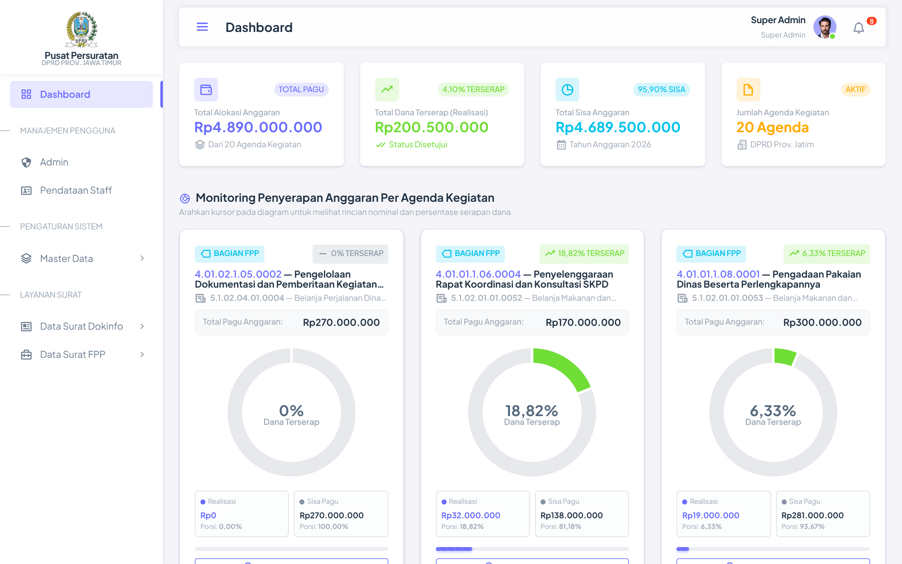

---

## 3. 🏛️ Portal Pemilihan Bagian

### Menu Pilihan Bagian Kedinasan
Antarmuka visual modern yang membagi operasional persuratan menjadi dua entitas utama dengan sampul tematik:
- **Bagian Dokinfo**: Dokumentasi, Publikasi Media, dan Peliputan Informasi.
- **Bagian FPP**: Fasilitasi Penganggaran dan Pengawasan Dewan.

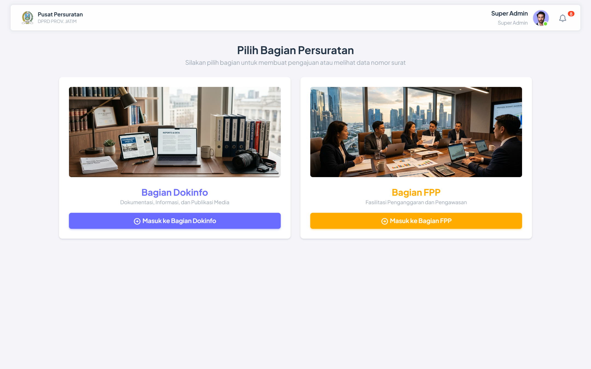

---

## 4. 📑 Pengelolaan Nota Pencairan Dana (NPD)

### 4.1 Daftar Alokasi & Rekening NPD
Menampilkan tabel pagu per sub kegiatan dan kode rekening belanja, realisasi terserap, sisa anggaran aktif, serta tombol aksi cepat untuk input pengajuan baru dan monitoring detail.

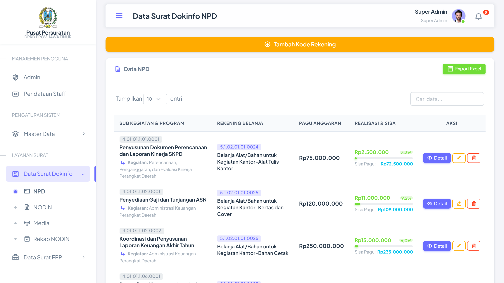

### 4.2 Form Pengajuan NPD Baru
Formulir input pengajuan NPD lengkap dengan nomor surat otomatis berformat baku (`[Kode]/KPA/PPU.03/[Bulan]/[Tahun]`), deteksi sisa anggaran, serta kolom nama penginput resmi ASN.

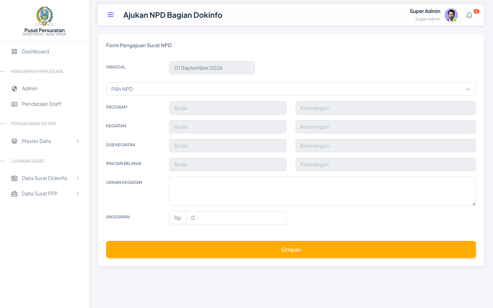

### 4.3 Detail & Monitoring Status Persuratan NPD
Tabel tracking riwayat pengajuan surat NPD. Dilengkapi fitur *expandable text* ("Lihat Selengkapnya"), badge status (*Disetujui*, *Diajukan*, *Ditolak*), catatan alasan penolakan, tombol **Perbaiki** bagi staf pengaju, serta tombol persetujuan bagi Admin.

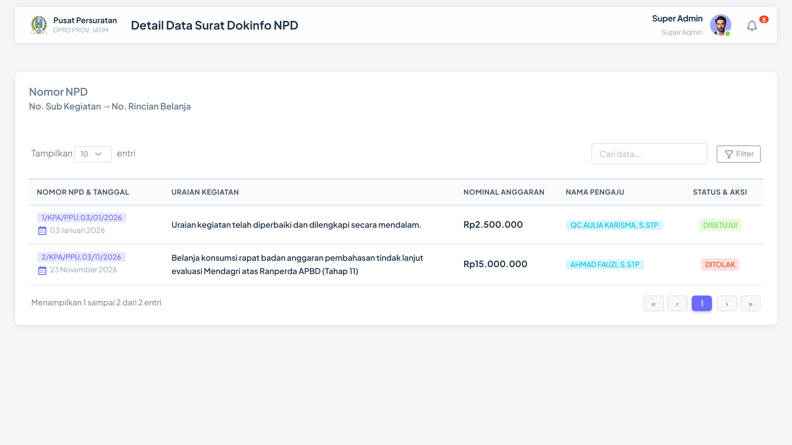

---

## 5. ✉️ Pengelolaan Nota Dinas (NODIN)

### 5.1 Daftar Pengajuan Nota Dinas
Daftar seluruh nota dinas kedinasan yang memuat Nomor Index Surat, Sub Kegiatan, Kode Rekening Belanja, Perihal yang dapat diperluas, Staf Pelaksana (*Atas Nama*), serta filter status interaktif.

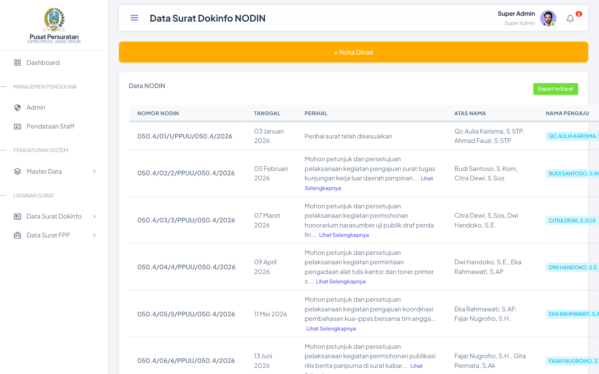

### 5.2 Form Pengajuan Nota Dinas Baru
Formulir permohonan nota dinas dengan integrasi nomor index kegiatan, rentang tanggal pelaksanaan tugas dinas, dan pemilihan multi-staf pendamping.

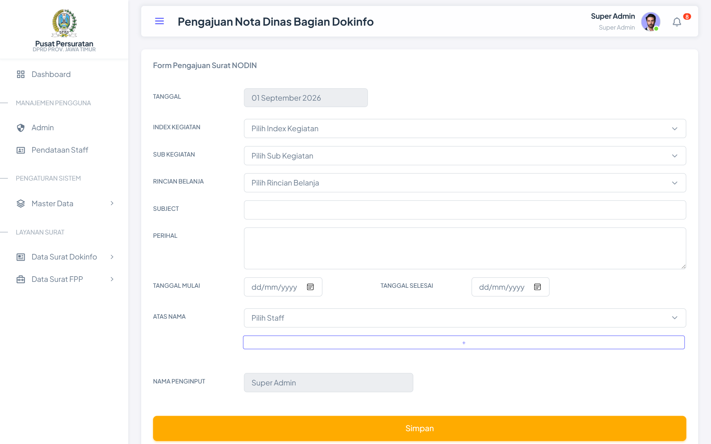

---

## 6. 📰 Manajemen Media & Publikasi Pemberitaan

### 6.1 Master Data Rekanan Media
Tabel manajemen rekanan media cetak, televisi, radio, dan portal berita online. Mencakup pencatatan Harga Penawaran, Harga Kesepakatan (*Deal*), dan Perhitungan Otomatis Pajak PPN.

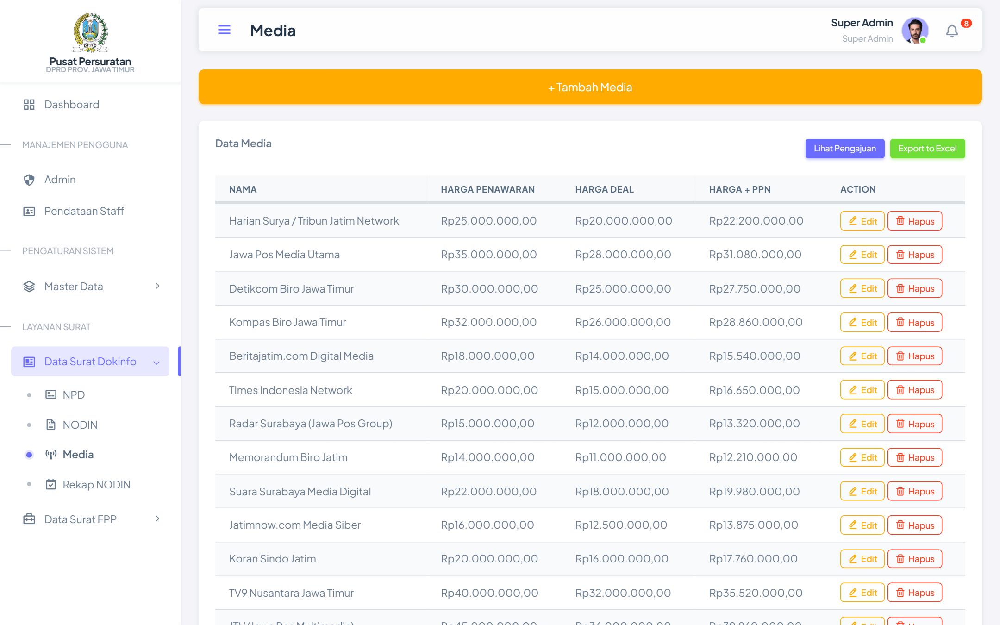

### 6.2 Pengajuan Publikasi Berita Media
Monitoring usulan publikasi materi kedinasan dewan, rincian biaya penayangan advertorial/berita, biaya fotokopi berkas, dan status verifikasi persetujuan liputan.

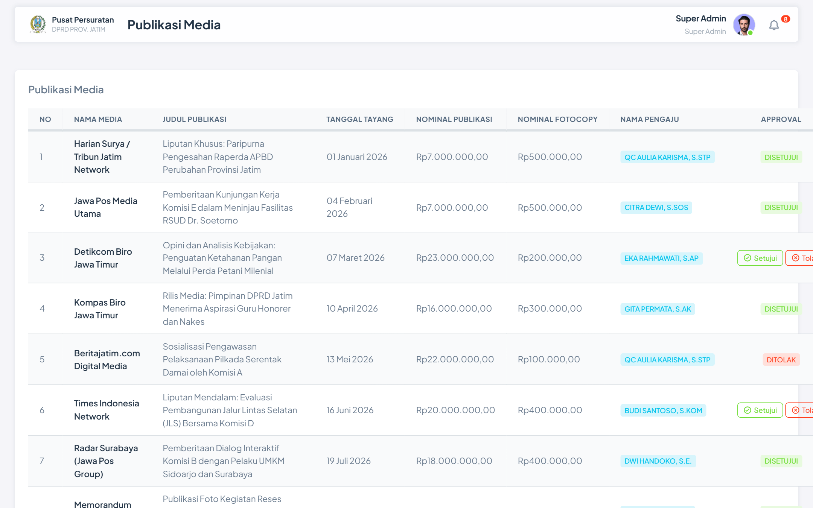

---

## 7. ⚙️ Master Data & Konfigurasi Sistem

### 7.1 Master Sub Kegiatan
Pencatatan hierarki perencanaan daerah yang mencakup Kode & Uraian Program, Kode & Uraian Kegiatan, serta Kode Sub Kegiatan SKPD.

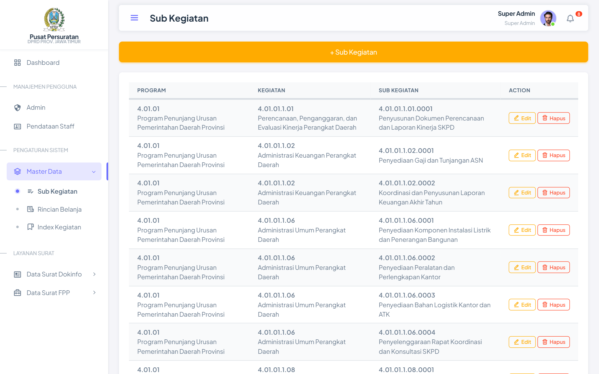

### 7.2 Master Rincian Belanja
Pengelolaan kode rekening belanja APBD beserta keterangan peruntukan belanja barang, jasa, dan modal.

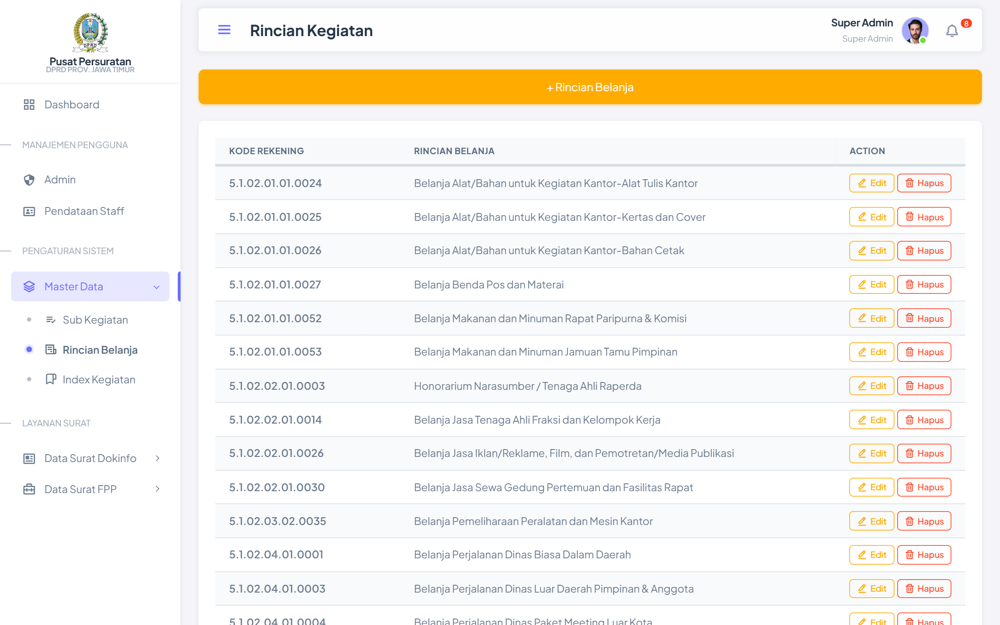

### 7.3 Master Index Kegiatan Persuratan
Klasifikasi kode naskah dinas dan tata kearsipan resmi sekretariat DPRD Jawa Timur.

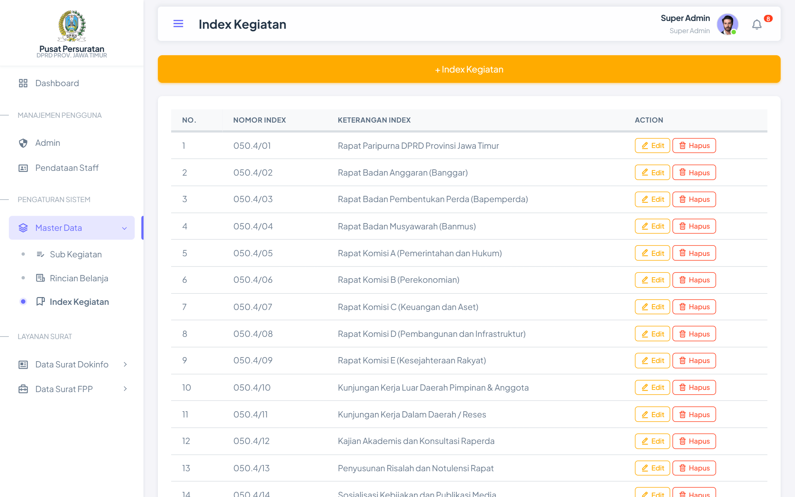

---

## 8. 👥 Manajemen Pengguna & Hak Akses

### 8.1 Manajemen Staf
Pengelolaan akun staf persuratan dengan identitas resmi lengkap (Nama Bergelar, NIP 18 Digit, dan Jabatan Kedinasan), form tambah/edit modal, serta proteksi aksi.

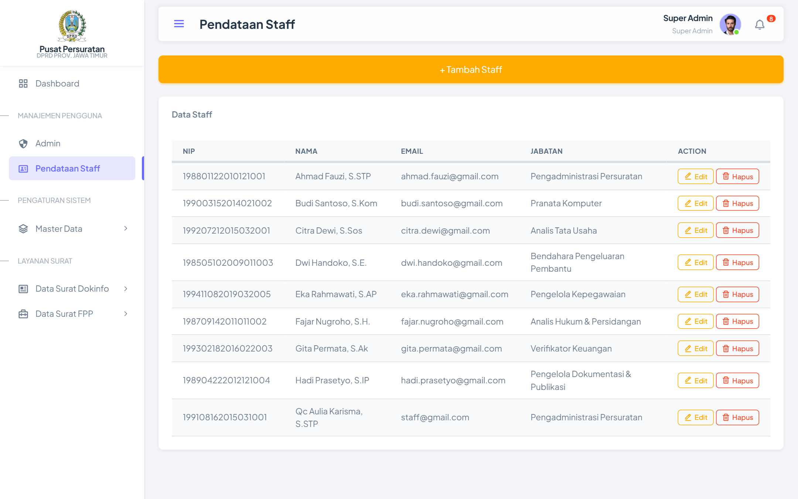

### 8.2 Manajemen Admin
Pengaturan akun administrator (Super Admin, Admin Bagian Dokinfo, dan Admin Bagian FPP) lengkap dengan upload foto profil kedinasan.

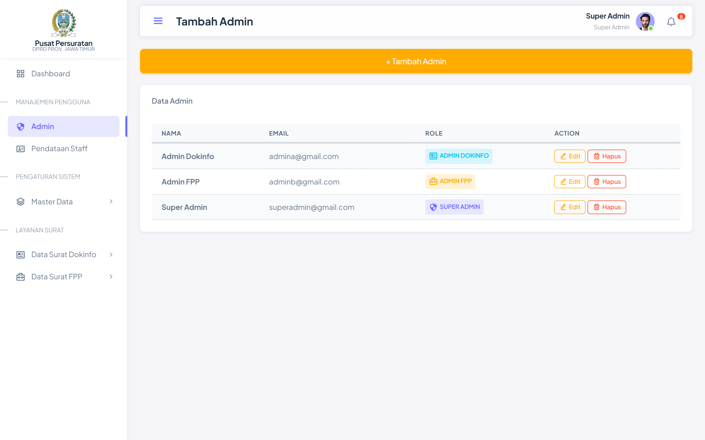

---

## 9. 🔔 Notifikasi & Konfirmasi Interaktif

### 9.1 Dropdown Notifikasi Real-time
Pusat pemberitahuan pembaruan status surat yang terhubung dengan akun login aktif, badge merah dinamis, riwayat timestamp, dan tombol **"Tandai Dibaca"**.

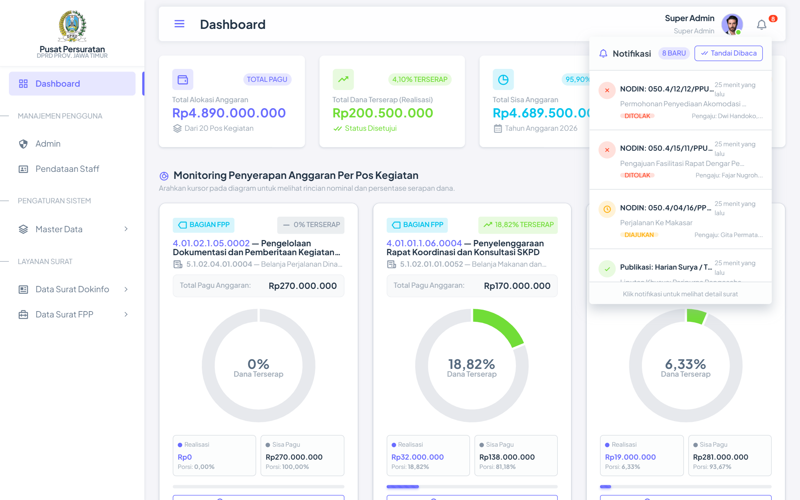

### 9.2 Pop-up Konfirmasi UI Modern (SweetAlert2)
Dialog konfirmasi aksi simpan, ubah, dan hapus yang terintegrasi secara visual dengan tema desain Sneat, menggantikan alert bawaan peramban (*browser native pop-up*).

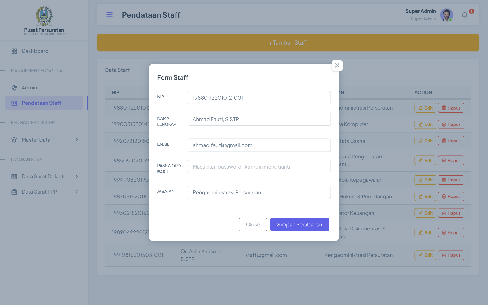
